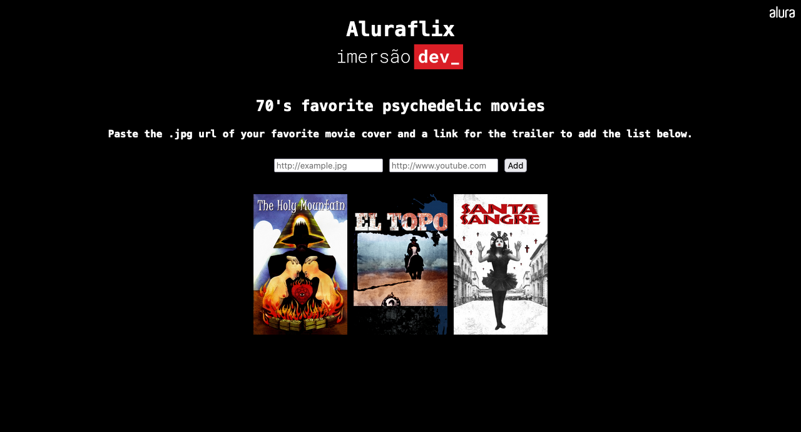

# Array, lista e AluraFlix (AluraFlix v1- ID3)

### Screenshot



https://imersao.dev/aulas/aula04-array-lista-aluraflix

### Conteúdo detalhado desta aula:

- Criar uma primeira array de filmes usando a sintaxe [];
- Utilizar o método filmes.push("Nome Do Filme") para inserir um novo elemento na lista (ou seja, um novo filme na array);
- Descobrir a quantidade de elementos em uma array com o método array.length;
- Selecionar elementos de uma array utilizando a sintaxe array[número], lembrando sempre que o primeiro índice começa com zero, ou seja, array[0] para o primeiro elemento;
- Utilizar a instrução for para iterar, ou seja, percorrer todos os elementos de uma array;
- Criar uma array com imagens de pôsters de alguns filmes que gostamos;
- Montar a lógica do programa que vai iterar esta array de filmes e exibir cada um deles na tela, integrando o for do JavaScript com document.write().

### Desafios desta aula!

- [x] Escolher o seu tema preferido para adaptar ao nosso código, ou seja, ao invés de filmes pode ser uma lista de animes, HQ's, cursos, capas de jogos...;
```html
<h2>70's favorite psychedelic movies</h2>
```

- [x] Tentar implementar outras versões da estrutura de repetição que fizemos com for, como por exemplo com foreach ou while;
```js
var count = 0;
while (count < listaFilmes.length) {
  document.write(
    `<a target="_blank" href=${listaFilmes[count][1]}></a>`
  );
  count++;
}
```
```js
var movieList = [];
var tagImg = document.getElementsByClassName("cover");
Object.values(tagImg).forEach((src) => movieList.push(src.getAttribute("src")));
```

- [x] Criar uma condição para não adicionar filmes repetidos, caso eles já tenham sido adicionados anteriormente;
```js
  if (!movieList.includes(cover)) {
    document.querySelector(
      "body"
    ).innerHTML += `<a target="_blank" href=${trailer}></a>`;
    movieList.push(cover);
  } else {
    alert("This movie is already on the list!");
  }
```

- [x] Criar um campo e botão para adicionar a imagem pela tela, e não direto no código.
```js
document.write(`
  <h4>Paste the .jpg url of your favorite movie cover and a link for the trailer to add the list below.</h4>
  <form onsubmit="newMovie()">
    <input type="url" id="urlJpg" placeholder="http://example.jpg" required>
    <input type="url" id="urlTrailer" placeholder="http://www.youtube.com">
    <input type="submit" id="add" value="Add">
  </form>
`);
```

A [Pen](https://codepen.io/rhatiro/pen/gOzLwYE) by [rhatiro](https://codepen.io/rhatiro) on [CodePen](https://codepen.io).

[License](https://codepen.io/license/pen/gOzLwYE).
